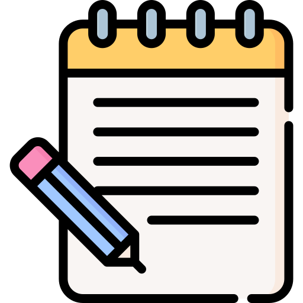

# drivenotes

# DriveNotes Sync 📱➡️☁️

## App Icon

**Offline-first notes with Google Drive backup**

---
-----------------------------------------------------------------------

## 📱 App Preview

  
  
  
  
  
  

---

## 🚀 Key Features

| Feature | Description |
|---------|-------------|
| **🔒 Secure Authentication** | Google OAuth 2.0 login with multi-account support |
| **📱 Offline-First** | Notes save locally and sync when online |
| **🔄 Auto-Sync** | Seamless background synchronization with Google Drive |
| **✏️ Rich Editing** | Markdown support with live preview |
| **⏱️ Version History** | Track changes through Google Drive |
| **Dark Mode/Light Mode** | user can freely switch between dark/light mode |

## 📥 How to Install
1. Download the latest APK from [Releases](https://github.com/Mohit-Smarth-Arora/driveNotes/releases/tag/v1.0.0)
2. Open the downloaded `.apk` file
3. Tap "Install" (enable "Unknown sources" if prompted)
4. Launch the app and sign in with Google

> ⚠️ **Note**: Google Drive sync requires internet connection

---

## ✨ Key Features
- **Work offline** - Notes save locally first
- **Oauth Authentication**
- **Auto-sync** to Google Drive when online
- **Material Design** with dark/light themes
- **Multiple Account Support** - user can switch accounts simultaneously

---
